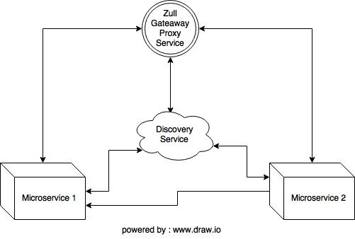
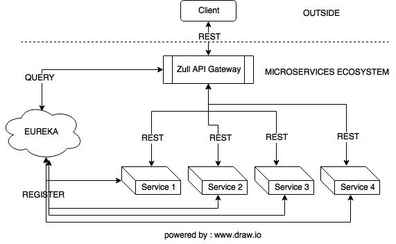

# Spring Cloud Zull #

Roadmap

* Overview Spring Cloud Zull 
* Build from scratch
* Live Demo

## Zull Proxy ##

* Common problem microservices -> is provide a unique gateway to the client applications of system
* Service are split into small microservices apps that shouldn't be visible to users -> development / maintenance efforts

To solve : Netflix created and open-sourced its `Zull Proxy server` and Spring has adapted -> `spring cloud stack`

## Zull Proxy Abstraction ##

* Zull diagram-1 : Zull service will intercept all the requests and then route the requests to actual services



* All request will be in REST 



## Build dan Run ##

### Spring Boot Initializr ###

1. Browse [https://start.spring.io/] (https://start.spring.io/)

2. Fill Project Metadata

    Group
    
    ```
    com.sheringsession.balicamp.springzull    
    ```

    Artifact
    
    ```
    zull-proxy
    ```
   
    Dependencies
    
    ```
    Eureka Discovery, Eureka Server, Zull
    ```
   
3. Generate Project

4. Download dan import to each IDE
    

### Build with Maven ###

1. In `pom.xml` makesure for dependency
    
    ```
    <dependencies>
		<dependency>
			<groupId>org.springframework.cloud</groupId>
			<artifactId>spring-cloud-starter-config</artifactId>
		</dependency>
		<dependency>
			<groupId>org.springframework.cloud</groupId>
			<artifactId>spring-cloud-starter-eureka</artifactId>
		</dependency>
		<dependency>
			<groupId>org.springframework.cloud</groupId>
			<artifactId>spring-cloud-starter-zuul</artifactId>
		</dependency>
	</dependencies>
    
    <dependencyManagement>
		<dependencies>
			<dependency>
				<groupId>org.springframework.cloud</groupId>
				<artifactId>spring-cloud-dependencies</artifactId>
				<version>${spring-cloud.version}</version>
				<type>pom</type>
				<scope>import</scope>
			</dependency>
		</dependencies>
	</dependencyManagement>
    ```

2. `applicatioin.properties` rename into `bootstrap.yml`

    ```
    spring:
      application:
        name: proxy
      jpa:
        hibernate:
          ddl-auto: validate
      cloud:
        config:
          discovery:
            enabled: true
            service-id: configservice
          fail-fast: true

    #cara 1 dengan menggunakan path
        catalog:
          path: /ctx/**

    #cara 2 dengan init key catalog langsung
    #    catalog: /catalog/**

    #cara 3 dengan menggunakan inisial serviceId
    #     katalog:
    #      serviceId: catalog
    #      path: /catalog/**

    ---
    spring:
      profiles: native
    server:
      port: 8799
    eureka:
      instance:
        hostname: localhost:8799
      client:
          serviceUrl:
            defaultZone: https://localhost:8761/eureka/,https://localhost:8762/eureka/
    ```

3. Add `@EnableZuulProxy` into your spring project configuration

    ```
    @SpringBootApplication
    @EnableZuulProxy
    public class ProxyApplication {

        public static void main(String[] args) {
            SpringApplication.run(ProxyApplication.class, args);
        }
    }
    ```

### Try in browser... ###